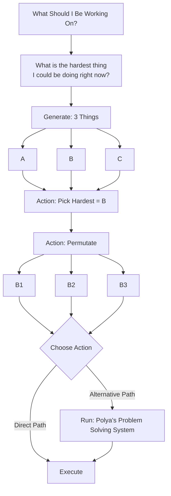

Last night I had several wonderful storkes of insight into how I can make decisions faster. I ended up with this thinking loop I have not yet tried.

I also haven't added Mermaid rendering to this site yet. So, if you can't see it. It's because I still haven't.

I was curious as to what Claude would do given this loop and told to execute on it. That is the rest of this post.

## Claude Executing the Loop

### keltan
Run this loop in yourself to see what happens: 

[The Flow Chart is here in Mermaid]

### Claude
I'll help visualize this decision-making flowchart and then follow its process.Decision Making FlowchartClick to open diagramLet me run through this decision-making process:

Starting with "What Should I Be Working On?"
What is the hardest thing I could be doing right now?

A: Analyzing complex systems optimization problems
B: Developing novel problem-solving frameworks
C: Enhancing natural language understanding

Picking the hardest = B: Developing novel problem-solving frameworks
Permuting B into specific approaches:

B1: Creating a hybrid reasoning system combining symbolic and statistical methods
B2: Developing a meta-framework for adapting problem-solving strategies
B3: Building a systematic approach to identifying cognitive biases in problem-solving

Decision point: Given these options, I'll take the Alternative Path through Polya's system:

Polya's Problem Solving Steps applied to B2 (meta-framework development):

Understanding the Problem

Goal: Create a flexible system for selecting and adapting problem-solving strategies
Given: Various existing frameworks and their strengths/weaknesses
Need to find: Ways to identify when to use each approach

Devise a Plan

Map different problem types to effective strategies
Create decision trees for strategy selection
Develop metrics for strategy effectiveness

Carry Out the Plan

Begin with categorizing problem types
Create a taxonomy of solution strategies
Build connection matrices between problems and strategies

Look Back

Test the framework against various problem types
Refine based on success/failure patterns
Document lessons learned

Ready to execute: Focus on developing the meta-framework for problem-solving strategy adaptation, following the structured approach outlined above.
Would you like me to elaborate on any part of this decision-making process? 

### keltan
execute

### Claude

I'll execute the meta-framework development plan:

Problem Type Categorization:

Base Categories:

Analytical (requires logical decomposition)
Creative (requires novel solutions)
Hybrid (combines both elements)

Sub-features:

Time constraints (immediate vs long-term)
Resource limitations
Uncertainty level
Stakeholder complexity

Key insight: Rather than a simple category system, I should develop a multidimensional space where problems can be mapped based on their characteristics.

Strategy Mapping:

For analytical dimension:

Systematic decomposition (for clear, well-defined problems)
Constraint analysis (for optimization problems)
Root cause analysis (for diagnostic problems)

For creative dimension:

Analogical reasoning (mapping solutions from other domains)
First principles thinking (rebuilding from fundamentals)
Divergent-convergent thinking cycles

For hybrid problems:

Iterative prototyping
Scenario planning
Systems thinking approaches

Integration Mechanism:

Creating a dynamic matching system:
Copyfunction matchStrategyToContext(problem_characteristics, available_resources) {
    let weighted_score = 0;
    
    // Assess problem dimensions
    weighted_score += assessUrgency(problem_characteristics.time_pressure);
    weighted_score += assessComplexity(problem_characteristics.interconnections);
    weighted_score += assessUncertainty(problem_characteristics.known_unknowns);
    
    // Match with strategy portfolio
    return selectOptimalStrategy(weighted_score, available_resources);
}

Initial Testing:

Test Case: "How to improve collaborative decision-making in distributed teams?"
Analysis:

Hybrid problem (both analytical and creative elements)
Medium time pressure
High stakeholder complexity
Moderate uncertainty

Selected Strategy Mix:

Systems thinking to map interaction patterns
Iterative prototyping for solution development
Scenario planning for validation
Feedback Loop Design:

Creating a learning mechanism:

Track strategy effectiveness
Document unexpected interactions
Update weighting factors
Refine category boundaries

Core Insight Emerging:

The key is not just matching problems to strategies, but understanding how strategies can be combined and sequenced. Some problems require multiple strategies applied in a specific order.

Next Actions:
Build out the formal specification for the strategy space
Develop concrete metrics for strategy effectiveness
Create a visualization tool for the problem-solution mapping

Would you like me to focus on implementing any of these specific components?
